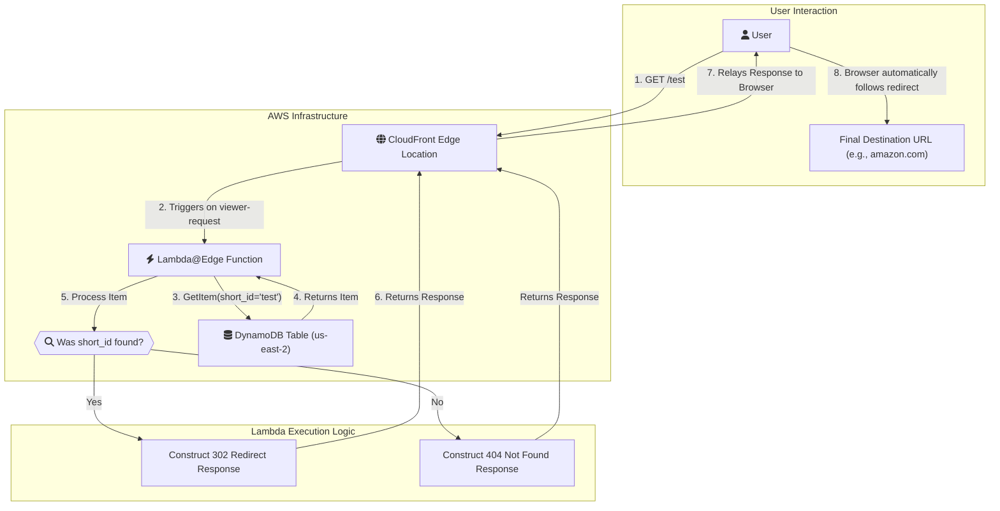

# Serverless Geo-Aware URL Shortener on AWS

A globally distributed URL shortener built entirely on AWS serverless technologies. This project shows geographic routing which allows it to redirect users to different destination URLs based on their country of origin.


### Architecture


## Key Features

- **Fast:** Use AWS CloudFront and Lambda@Edge to serve redirects from over 400 edge locations, providing minimal latency.
- **Geo-Routing:** Redirects users to different destination URLs based on their country (via the `CloudFront-Viewer-Country` header). For example, a link can point to `amazon.com` for US users and `amazon.ca` for Canadian users.
- **Fully Serverless:** No servers to manage. It is entirely built on managed AWS services.
- **Dynamic & Scalable:** The system can handle limitless short links and traffic spikes without performance degradation.
- **Infrastructure as Code (IaC):** The entire AWS stack is defined and deployed using the AWS SAM, allowing consistent and repeatable deployments.

## Tech Stack

- **Compute:** [AWS Lambda@Edge](https://aws.amazon.com/lambda/edge/) (Python 3.12)
- **CDN:** [AWS CloudFront](https://aws.amazon.com/cloudfront/)
- **Database:** [AWS DynamoDB](https://aws.amazon.com/dynamodb/) (NoSQL)
- **Permissions:** [AWS IAM](https://aws.amazon.com/iam/)
- **IaC Framework:** [AWS SAM](https://aws.amazon.com/serverless/sam/)

## How It Works

1.  A user requests a short URL (e.g., `https://your-domain.com/test`).
2.  The request hits the nearest CloudFront Edge Location.
3.  The CloudFront distribution triggers the `viewer-request` Lambda@Edge function.
4.  The Lambda function extracts the `short_id` (`test`) from the URL path and the viewer's two-letter country code from the `CloudFront-Viewer-Country` header.
5.  It queries the DynamoDB table for an item with that `short_id`.
6.  Based on the country code, it selects the appropriate destination URL from the item's `destinations` map. If a country-specific URL isn't found, it falls back to a `default` URL.
7.  The function returns an HTTP 302 redirect response to the user's browser, sending them to the final destination.

## Getting Started

### Prerequisites

- [AWS CLI](https://aws.amazon.com/cli/) configured with your credentials.
- [AWS SAM CLI](https://docs.aws.amazon.com/serverless-application-model/latest/developerguide/serverless-sam-cli-install.html) installed.
- [Docker](https://www.docker.com/products/docker-desktop) running (required by SAM for building the function).

### Deployment

The entire infrastructure is defined in the `template.yaml` file. Deploying is as simple as running a few SAM commands.

1.  **Clone the repository:**
    ```bash
    git clone https://github.com/Sequence9/Serverless-Geo-aware-URL-Shortener
    cd Serverless-Geo-aware-URL-Shortener
    ```

2.  **Build the application:**
    This command packages the Lambda function into a deployment-ready artifact.
    ```bash
    sam build
    ```

3.  **Deploy the stack:**
    This command will deploy all the AWS resources defined in the template. The `--guided` flag will walk you through the deployment prompts on the first run.
    ```bash
    sam deploy --guided
    ```
    - **Stack Name:** Give your stack a unique name (e.g., `url-shortener-app`).
    - **AWS Region:** **IMPORTANT!** You must deploy this stack to **`us-east-1`** because Lambda@Edge functions must reside in this region.
    - **Confirm changes before deploy:** Answer `y` to review the changes.
    - **Allow SAM CLI IAM role creation:** Answer `y`.
    - **Save arguments to samconfig.toml:** Answer `y` to save your choices for future deployments.

After deployment, the SAM CLI will output the `CloudFrontDomainName`. This is the base URL for your shortener.

### Adding Links

To add or manage links, you can add items directly to your DynamoDB table (`url-shortener`) via the AWS Management Console or the AWS CLI.

Each item must have:
- A `short_id` (String): The path for your short link.
- A `destinations` (Map): An object containing the destination URLs.
  - This map **must** contain a `default` key.
  - You can add other keys with two-letter country codes (e.g., `US`, `CA`, `DE`).

**Example Item (JSON):**
```json
{
  "short_id": "shop",
  "destinations": {
    "default": "https://www.amazon.com",
    "CA": "https://www.amazon.ca",
    "UK": "https://www.amazon.co.uk",
    "DE": "https://www.amazon.de"
  }
}
```

### Testing

Once deployed, you can test a link by appending a `short_id` to your CloudFront domain name:
`https://<your-cloudfront-domain-name>/shop`

## Author

- **Sequence9(https://github.com/Sequence9)**
